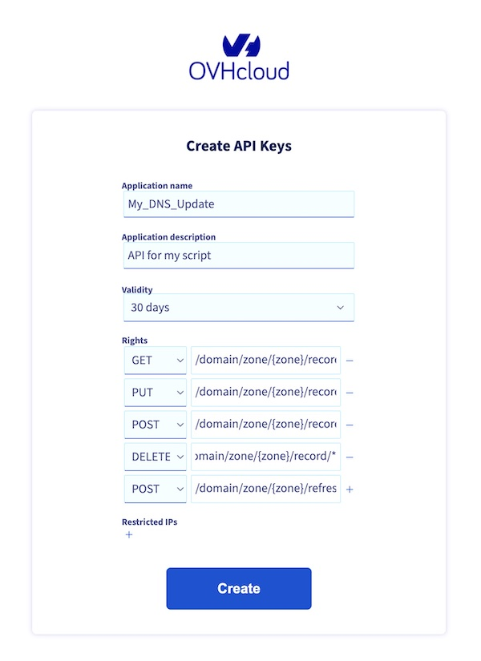

# OVH DNS Update
If you have a domain hosted at OVH you can using API udate it's A record.  

I have prepared 3 methods to do so:  

## Bash
Simple script using Curl to read "A" record ID and send new one  
It is set to take new IP from current location using curl icanhazip.com  
It will save result in ip.list file and before the next run compare if there are changes to it.  
Please remember update get.sh file with data from creating a token 
Also running on Mac please update line 55 as it will not save output to the ip.list file  
Do so by installing gnu-sed and changing code to gsed  
There are also getip.service and getip.timer file in order to run the script in schedule  
## Python
Again very simple script using OVH library (remember to run pip install ovh)  
It also write the result to file and compare it before next run.  
Remember to fullfill ovh.conf file with data from creating a token  
In order to read the myip.txt file remember to run code including directory it is placed in  
## Terraform
I managed also to create a terraform option.  
It has one caviot - if it is run for the first time (no tfstate file)  
the domain need to be without "A" records, as it will create new one "A" record - not update any existing ones  
Also remember to enter data from token creation into terraform.auto.tfvars file. 

### Token
In order to get your application key and secret please visit: https://www.ovh.com/auth/api/createToken  
and create token as on the picture below (change {zone} for your domain name) and enter "/domain/zone/{zone}/record/*"  
for all four methods (GET, PUT, POST, DELETE) and in order to refresh domain add POST for "/domain/zone/{zone}/refresh"  
